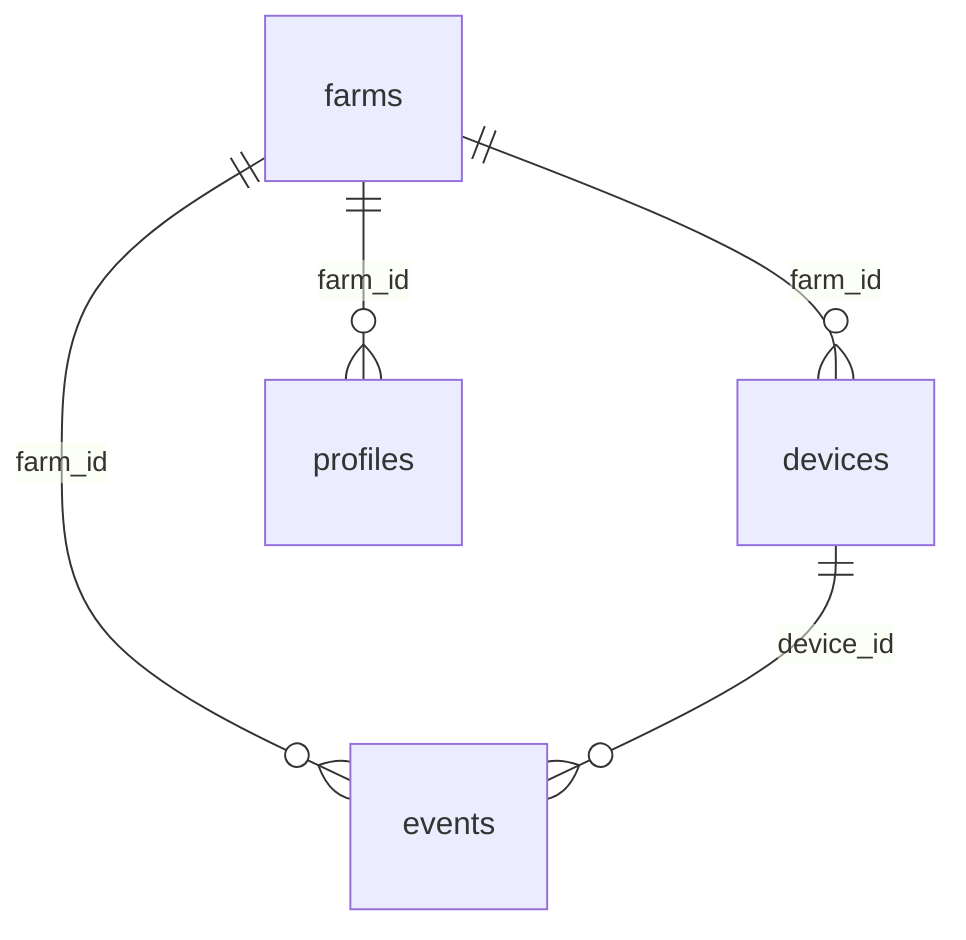

# Base de Datos — Supabase Schema

> Para el schema SQL completo, ver [`docs/supabase_schema.sql`](docs/supabase_schema.sql).

## Relaciones Principales

| Origen | FK | Destino |
|---|---|---|
| `events.farm_id` | → | `farms.id` |
| `events.device_id` | → | `devices.id` |
| `devices.farm_id` | → | `farms.id` |
| `profiles.farm_id` | → | `farms.id` |

## Seguridad

* **RLS (Row Level Security):** Activo en todas las tablas multi-tenant.
* **Roles:** `anon` (lectura limitada), `authenticated` (acceso por `farm_id`), `service_role` (acceso total).
* **Storage Bucket:** `alerts` — Archivos WAV de eventos detectados.